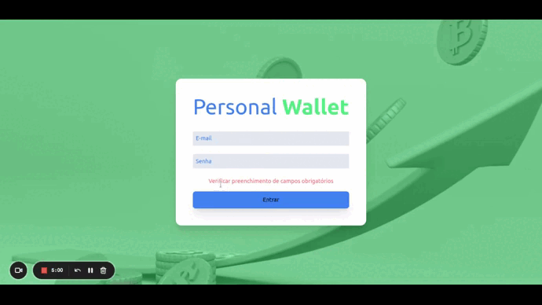

# 💰 Personal Wallet app

  

## 📝 About this Project

React application responsible for controlling expenses with a currency converter, when using this application a user should be able to:

> Add, remove and edit an expense;

> View a table with your expenses;

> View total spend converted to a currency of choice;

The main focus of the project was to practice using redux and creating asynchronous actions in the react application.

 Deploy: https://personal-wallet-mocha.vercel.app/

## 🌐 Required Skills:

- Creating a Redux store in React apps

- Create reducers in Redux in React applications

- Create actions in Redux in React applications

- Create dispatchers in Redux in React applications

- Connect Redux to React Components

- Create asynchronous actions in your React application that uses Redux.


## 🛜 Installing the repository on your machine

```js
git clone git@github.com:douglasbacelar/personal-wallet.git
npm install
npm start
```

## 🔧 Tools and Methodologies Used

> HTML5 Semântico

> CSS

> JavaScript

> React.js

> Redux

> Tailwind


## ✅ Improvement points

> Improve responsiveness

## 💻 Author

Desenvolvido por [Douglas Bacelar](https://www.linkedin.com/in/douglasbacelar/)